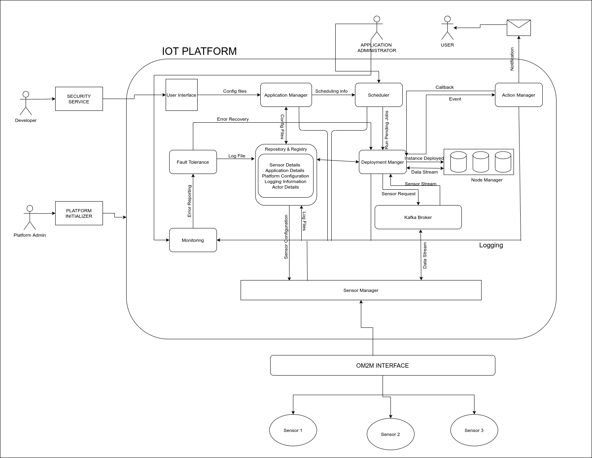

# Distributed platform for IoT Applications

## Introduction
This is a `distributed platform to host IoT-based applications`. It provides a web interface to deploy, run and monitor applications.The distributed nature of the platform provides fault tolerance while being highly scalable. 

## Features
* Developers can create application without any information about the location of sensors.
* End-Users can use the applications without actually downloading or hosting the application themselves.
* End-Users can use the applications without dealing with the sensors directly.
* Scalable as each component is micro-service.
* Platform ensures that both components and applications recover from fault(downtime) without loss of data.
* Single Management console for platform administrator.

## Design and Architecture

## Working
The platform can be divided into various Micro-Services:
- Application Manager: Manage applications and provide web interface to all users.
- Scheduler: Schedule the applications as demanded by users.
- Deployer: Deploys the applications in docker containers in the servers(thus providing isolation), provides load balancing, logs of the applications, status and fault tolerance of the applications.
- Sensor Manager: Registers the sensors on the platform, fetches the data from the sensors, binds the data of sensors to the applications running in platform.
- Action Manager: Action manager exposes API which provies notification services and device control options.
- Monitoring module: Monitors the health of the above microservices of the platform.
The various microservices use [Apache Kafka](https://kafka.apache.org/) for communication between them, thus our platform follows event driven microservices architecture which makes it highly scalable and fault tolerant.

## Prerequisites
* [Apache Kafka](https://kafka.apache.org/) up and running.
* [MongoDB](https://www.mongodb.com/) up and running.
* [Docker](https://www.docker.com/) on machines where applications are to be run.
* Python Packages on machine where services are to be run -
    * kafka-python
    * pymongo
    * docker
    * boto3
    * paramiko
    * bson.json_util
    * pickle
    * zipfile
    * schedule
    * requests
    * flask
* Publicly accessible VMs to run micro-services.

## Installation
- To deploy a service on a particular AWS EC2 server, give its IP on the [config.json](Source/bootstrap/config.json) file in the bootstrap folder. The private keys of the servers(.pem files ) should be present to allow SSH into those servers.
* After this, execute `python3 runm.py` to deploy the services on the respective servers. 
- Platform can now be accessed on the IP where the application manager is running. `http://<IP>:80`.

## Screenshots

